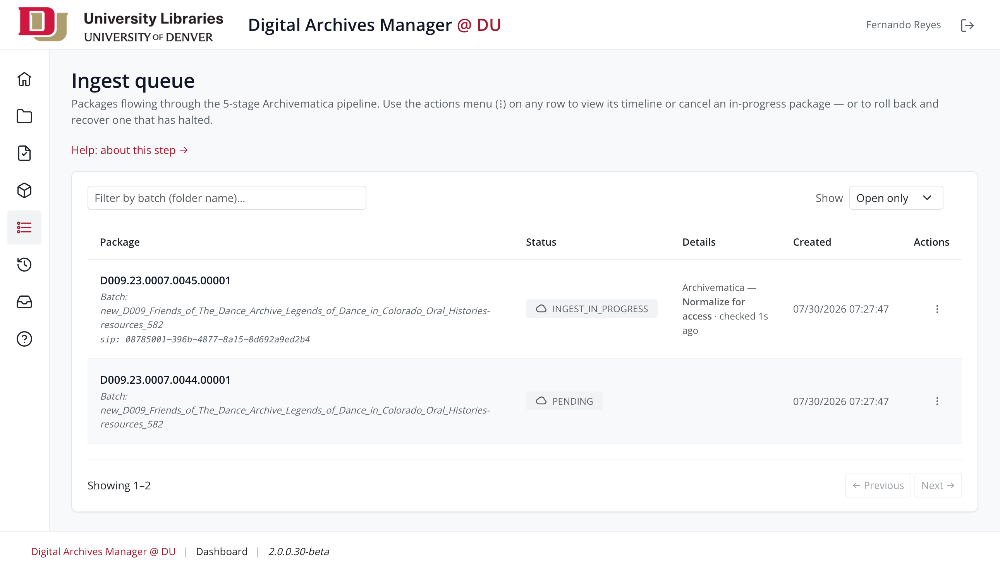
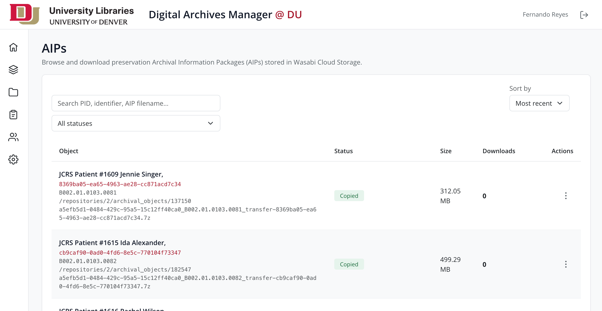
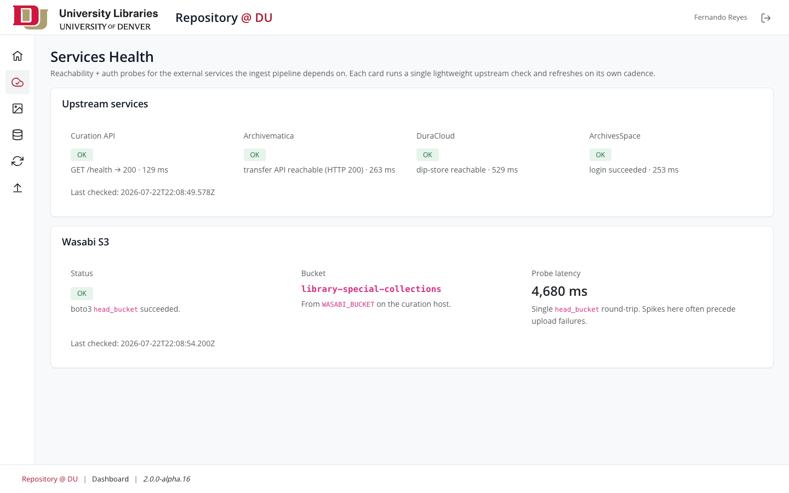

# Digital Archives Manager @ DU

## Table of Contents

* [README](#readme)
* [Architecture Overview](#architecture-overview)
* [Releases](#releases)
* [Contact](#contact)

## README

### Background

Backend and staff dashboard for the University of Denver Libraries' digital repository. Staff manage collections and objects, run the six-stage Archivematica ingest pipeline, refresh descriptive metadata from ArchivesSpace, and maintain the Wasabi preservation tier under role-based access; published objects are indexed into Elasticsearch, where the public site ([digitaldu-frontend](https://github.com/dulibrarytech/digitaldu-frontend)) reads them.

### Screenshots

**Dashboard home — stats**


<hr>

**Objects browse — bulk publish, suppress, and metadata refresh**


<hr>

**Pre-ingest workspace — Make Digital Objects, ASpace QA, Packaging**


<hr>

**Ingest Queue**



<hr>

**Preservation tier — AIP browse and download**



<hr>

**Services health — live probes for every external dependency**



### Contributing

Check out our [contributing guidelines](/CONTRIBUTING.md) for ways to offer feedback and contribute.

### Licenses

[Apache License 2.0](https://www.apache.org/licenses/LICENSE-2.0).

All other content is released under [CC-BY-4.0](https://creativecommons.org/licenses/by/4.0/).

### Local Environment Setup

**Prerequisites**

* Node.js **20+** — pinned via `.nvmrc`.
* MySQL **8+** or MariaDB **10.6+** — two databases: `repo` and `repo_queue`.
* Java **11+ runtime** — only for handle minting. The [Handle.net client library](https://www.handle.net/download_hnr.html) supplies the jars; see [Persistent identifiers (Handle.net)](#persistent-identifiers-handlenet).
* Optional (full functionality): Elasticsearch 8, ArchivesSpace, Archivematica, DuraCloud, the curation API, Kaltura, and the Handle/TN services are DU-internal — ingest, metadata refresh, indexing, and preservation flows need DU network/VPN. Core dashboard CRUD works without them.

**Install and configure**

```
cd repo-backend-v2
nvm use
npm ci                        # always npm ci — never ad-hoc npm install on a shared checkout
cp .env-example .env          # then fill in values (documented inline with rationale + defaults)
npm run vendor                # copy vendored client assets (Bootstrap, HTMX, Open Sans) from
                              # node_modules into public/assets — CSP self-only, no CDNs

```

**Database (migrations — idempotent, safe to re-run)**

```
# create empty repo + repo_queue databases (names = DB_NAME / DB_QUEUE_NAME in .env), then:
npm run migrate:all           # applies repo then repo_queue migrations
npm run migrate:status:repo   # show pending without applying (also :queue)
```

**Run**

```
npm start                     # node repo-backend-v2.js
npm run dev                   # same, with --watch auto-reload
# → http://localhost:8765/repo/dashboard/
```

Staff log in via DU SSO in production; local development uses the direct login endpoint (`POST /repo/auth/login` with an active `du_id` from `tbl_users`).

**Tests**

```
npm test                      # full suite: unit + integration + e2e
npm run test:unit             # pure functions, no I/O
npm run test:integration      # real sqlite-in-memory via knex
npm run test:e2e              # full app via supertest
npm run test:coverage         # coverage report under coverage/
npm run lint                  # ESLint 9 (flat config); lint:fix to autofix
npm run format:check          # Prettier 3; format to write
```

Integration + e2e bootstrap an in-memory sqlite DB from the same migration files as production — a schema change ships with its migration once and applies everywhere (test, dev, prod).

### Maintainers

@freyesdulib

## Architecture Overview

An Express 5 application (CommonJS, EJS + HTMX partials, Bootstrap 5) serving the staff dashboard and the REST API behind it. Content lives in MariaDB across two pools (`repo`, `repo_queue`); background workers run the ingest pipeline, ASpace metadata refresh, ES indexing, and TIFF conversion; published objects are projected into a single public Elasticsearch index that the public frontend reads directly.

### External services

| Service                       | Role                                                                                              |
| ----------------------------- | ------------------------------------------------------------------------------------------------- |
| **Archivematica + AM Storage Service** | Ingest pipeline target. Stage 3 starts transfers; Stage 4 polls ingest; AIP retrieved via Storage Service API for the preservation copy. |
| **ArchivesSpace**             | Source of truth for descriptive metadata. On-demand + system-wide refresh both fetch from here.   |
| **DuraCloud**                 | Active storage tier for AIPs (post-AM). Thumbnail proxy reads legacy thumbnails from here.        |
| **Wasabi S3**  | Preservation tier. Stage 6 + backfill copy AIPs here via the curation API.            |
| **[Curation API](https://github.com/dulibrarytech/digitaldu-backend-curation-service)** (Python) | Wasabi gatekeeper. Holds the boto3 credentials; v2 talks HTTP to it for both SFTP-staging and AIP copies. Also owns AM-folder QA. |
| **[Handle.net](https://www.handle.net/) server** | Mints persistent identifiers per object under the DU prefix. Reads over the handle HTTP JSON API; writes over the native protocol via the [official client library](https://www.handle.net/download_hnr.html). |
| **TN service**                | Generates fresh thumbnails from source files.                                                     |
| **Kaltura**                   | Streaming media for AV-bearing objects.                                                           |
| **DU SSO**         | Single sign-on (layered defense: IP allowlist + timestamp + HMAC).                                |

### Ingest pipeline

A six-stage state machine. Each stage is idempotent on resume; the worker awaits external systems (AM, DC, curation) on bounded budgets and only advances state when the upstream confirms.

```
Stage 1 (process_metadata) → ASpace fetch + transformer → workspace metadata snapshot
Stage 2 (upload)           → SFTP push to Archivematica drop
Stage 3 (transfer)         → AM start_transfer + approval + transfer polling
Stage 4 (ingest)           → AM ingest poll + DuraCloud propagation wait
Stage 5 (repository)       → tbl_objects insert + handle mint + SFTP cleanup + move-to-ingested
Stage 6 (aip_store)        → Curation /copy-to-wasabi → AIP lands in Wasabi S3
```

Stage 6 is gated by `AIP_STORE_ENABLED`. With the flag off, Stage 5 finalizes ingest the same way it did pre-Stage-6. Stages 1–5 run serially — one package at a time clears metadata, upload, AM transfer, AM ingest, and repository record before the next package starts; only Stage 6 overlaps, running in the background while the next package proceeds.

### Companion service: curation API

Package ingest is a two-service effort with [digitaldu-backend-curation-service](https://github.com/dulibrarytech/digitaldu-backend-curation-service), a Python API that owns the filesystem and storage operations this backend can't (or shouldn't) perform directly. During the pre-ingest workspace and Stage 2 it stages and QAs package folders on the Archivematica SFTP drop; during Stage 6 and AIP backfill it copies AIPs to Wasabi and mints the presigned download URLs the dashboard serves. It is the sole holder of the Wasabi (boto3) credentials — this backend carries only the `CURATION_API` URL and `CURATION_API_KEY`, and talks to it over HTTP under the `/api/v2/qa/*` and `/api/v2/aip/*` prefixes. Deploy the two services together: an ingest run cannot complete without both.

### System-wide metadata refresh

Admin-initiated, queue-paced re-fetch of every active object's ASpace metadata. Hardening levers (all env-configurable): per-request timeout, worker concurrency, tick cadence, retry budget with exponential backoff, and periodic ASpace session-token rotation. The admin page exposes a **Resume from last cancelled batch** opt-in so a new batch inherits the prior cancelled batch's cursor instead of restarting from the beginning.

### Storage tier (AIP store)

AIPs produced by Archivematica land in DuraCloud as part of standard AM operation, then get a second copy in **Wasabi S3** for long-term storage:

- **Live ingest:** Stage 6 fires automatically when `AIP_STORE_ENABLED=true`.
- **Backfill:** `/dashboard/admin/aip-backfill` chews through objects that pre-date the flag, in operator-controlled chunks.
- **Catalog:** `tbl_aip_store` holds one row per AIP (~20,800 legacy rows from the one-time DuraCloud → Wasabi migration plus ingest-time rows from Stage 6).
- **Downloads:** Dashboard renders a presigned Wasabi URL via the curation API; bytes never transit v2.

Wasabi credentials live in the curation service's env, not v2's — v2 carries only the `CURATION_API` URL + `CURATION_API_KEY`.

### Persistent identifiers (Handle.net)

Every ingested object gets a persistent identifier from a [Handle.net](https://www.handle.net/) server running under the DU prefix — minted in Stage 5, and by hand from **Admin Utils → Handles**. 

**Transport is split**, because the handle server offers no authentication over HTTP:

| Direction | Path | Implementation |
| --------- | ---- | -------------- |
| **Reads** (resolution, existence checks) | Handle HTTP JSON API (`/api/handles/…`) | `libs/handles.js` |
| **Writes** (create, modify, delete) | Native handle protocol, authenticated with the prefix administrator's private key | `libs/handle_writer.js` → `java/DuHandleTool.java` |

Writes shell out to **`DuHandleTool`**, a small Java helper built against the official Handle.net client library. It speaks newline-delimited JSON on stdin/stdout and supports a batch mode that pays the JVM start, resolver site-cache warm-up, and key decryption once per run rather than per handle.

**Client library** — download the Handle.net server/client distribution from <https://www.handle.net/download_hnr.html> and point `HANDLE_CLIENT_LIB` at its `lib/` directory (DU runs 9.3.1):

```
HANDLE_CLIENT_LIB=/path/to/handle-client-9.3.1/lib
```

**Building the helper** — `java/duhandletool.jar` is committed and travels with the checkout, so a deploy needs a JRE only. Rebuild on a development machine when `DuHandleTool.java` changes:

```
HANDLE_CLIENT_LIB=/path/to/handle-client-9.3.1/lib npm run build:handle-helper
```

It compiles with `--release 11`, so the bytecode runs unchanged on the production JRE. Do not install a JDK on the server for this.

**Guardrails** — minting requires the `manage_handles` permission (admin-only): it runs under the prefix administrator credential, the highest-privilege action the application can take. Hand-minted targets are restricted to the hosts in `HANDLE_ALLOWED_TARGET_HOSTS` (falling back to the `HANDLE_TARGET` host, so an unconfigured deployment is closed rather than open), suffixes are server-generated, and only handles minted through the view can be deleted from it. A collection folder whose name carries a token from `HANDLE_SKIP_BATCH_TOKENS` (default `test`) mints no handle at all, so test ingests against production never consume real identifiers.

Reference: [Handle.net technical manual](https://www.handle.net/tech_manual/HN_Tech_Manual_9.pdf) · [handle.net documentation](https://www.handle.net/documentation.html). All `HANDLE_*` settings are documented inline in `.env-example`.

## Releases

* v2.0.0.50-beta

## Contact

Ways to get in touch:

* Fernando Reyes (Developer at University of Denver) - fernando.reyes@du.edu
* Create an issue in this repository
