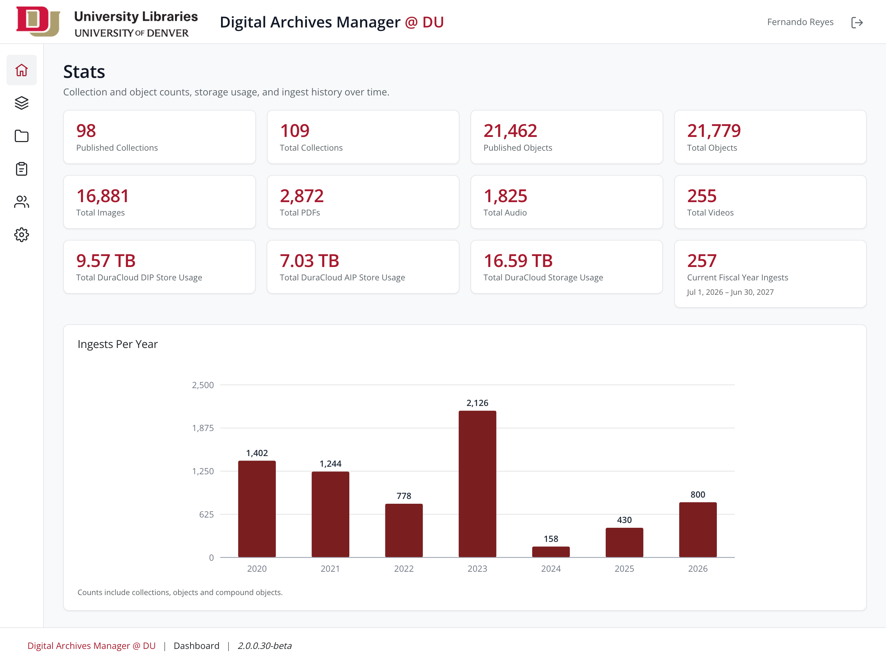
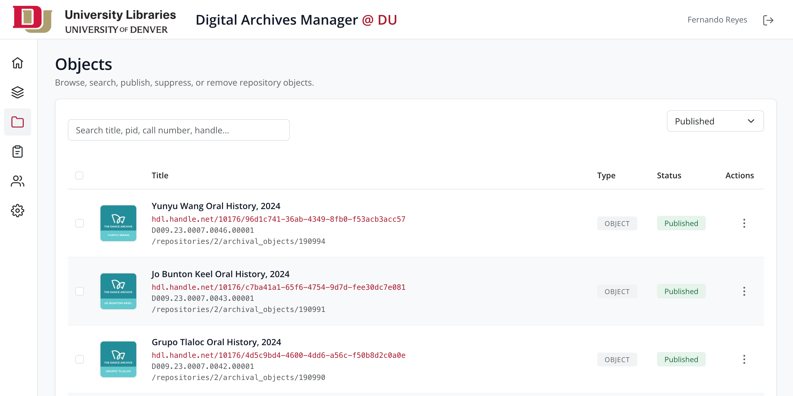
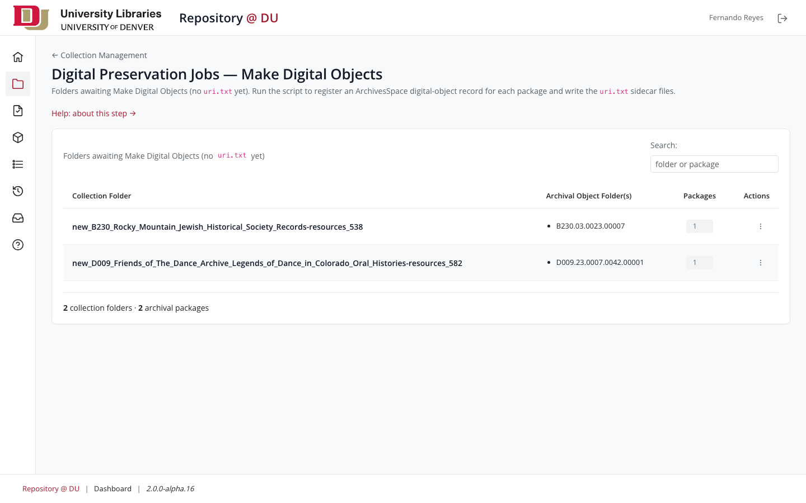
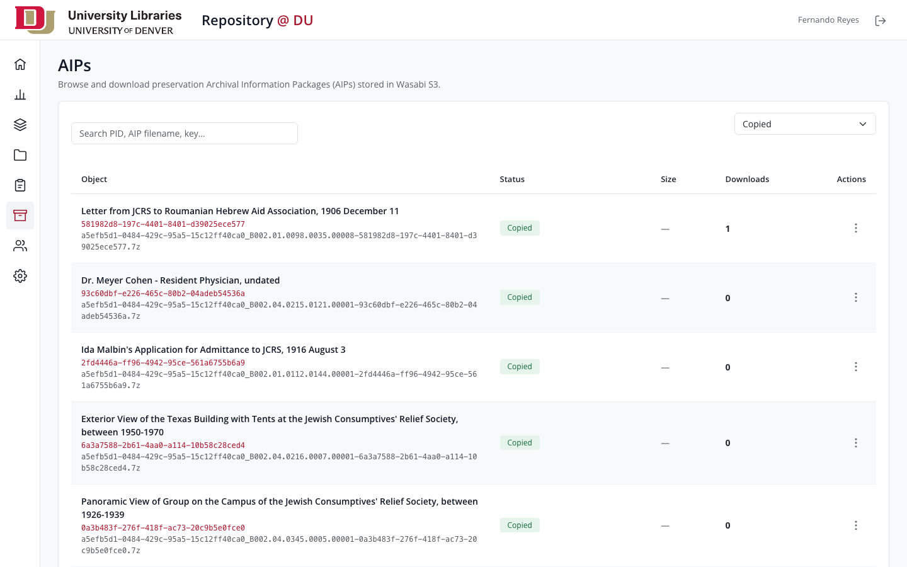

# DU Digital Repository Backend

## Table of Contents

* [README](#readme)
* [Architecture Overview](#architecture-overview)
* [Releases](#releases)
* [Contact](#contact)

## README

### Background

Backend and staff dashboard for the University of Denver Libraries' digital repository. Staff manage collections and objects, run the six-stage Archivematica ingest pipeline, refresh descriptive metadata from ArchivesSpace, and maintain the Wasabi preservation tier under role-based access; published objects are indexed into Elasticsearch, where the public site ([digitaldu-frontend](https://github.com/dulibrarytech/digitaldu-frontend)) reads them.

### Screenshots

**Dashboard home — recent ingests and top collections**



<br>

**Objects browse — bulk publish, suppress, and metadata refresh**



<br>

**Pre-ingest workspace — Make Digital Objects, ASpace QA, Packaging**



<br>

**Preservation tier — AIP browse and download**



<br>

**Services health — live probes for every external dependency**


### Contributing

Check out our [contributing guidelines](/CONTRIBUTING.md) for ways to offer feedback and contribute.

### Licenses

[Apache License 2.0](https://www.apache.org/licenses/LICENSE-2.0).

All other content is released under [CC-BY-4.0](https://creativecommons.org/licenses/by/4.0/).

### Local Environment Setup

**Prerequisites**

* Node.js **20+** — pinned via `.nvmrc` (`nvm use`).
* MySQL **8+** or MariaDB **10.6+** — two databases: `repo` and `repo_queue`.
* Optional (full functionality): Elasticsearch 8, ArchivesSpace, Archivematica, DuraCloud, the curation API, Kaltura, and the Handle/TN services are DU-internal — ingest, metadata refresh, indexing, and preservation flows need DU network/VPN. Core dashboard CRUD works without them.

**Install and configure**

```
cd repo-backend-v2
nvm use
npm ci                        # always npm ci — never ad-hoc npm install on a shared checkout
cp .env-example .env          # then fill in values (documented inline with rationale + defaults)
npm run vendor                # copy vendored client assets (Bootstrap, HTMX, Open Sans) from
                              # node_modules into public/assets — CSP self-only, no CDNs

```

**Database (migrations — idempotent, safe to re-run)**

```
# create empty repo + repo_queue databases (names = DB_NAME / DB_QUEUE_NAME in .env), then:
npm run migrate:all           # applies repo then repo_queue migrations
npm run migrate:status:repo   # show pending without applying (also :queue)
```

**Run**

```
npm start                     # node repo-backend-v2.js
npm run dev                   # same, with --watch auto-reload
# → http://localhost:8765/repo/dashboard/
```

Staff log in via DU SSO in production; local development uses the direct login endpoint (`POST /repo/auth/login` with an active `du_id` from `tbl_users`).

**Tests**

```
npm test                      # full suite: unit + integration + e2e
npm run test:unit             # pure functions, no I/O
npm run test:integration      # real sqlite-in-memory via knex
npm run test:e2e              # full app via supertest
npm run test:coverage         # coverage report under coverage/
npm run lint                  # ESLint 9 (flat config); lint:fix to autofix
npm run format:check          # Prettier 3; format to write
```

Integration + e2e bootstrap an in-memory sqlite DB from the same migration files as production — a schema change ships with its migration once and applies everywhere (test, dev, prod).

### Maintainers

@freyesdulib

## Architecture Overview

An Express 5 application (CommonJS, EJS + HTMX partials, Bootstrap 5 with DU theme tokens) serving the staff dashboard and the REST API behind it. Content lives in MariaDB across two pools (`repo`, `repo_queue`); background workers run the ingest pipeline, ASpace metadata refresh, ES indexing, and TIFF conversion; published objects are projected into a single public Elasticsearch index that the public frontend reads directly.

```
Staff ──▶ dashboard (EJS views + HTMX partials)
               │  REST (JWT cookie)
               ▼
             routes ──▶ controller ──▶ model ──▶ MariaDB (repo · repo_queue)
                              │
              workers: ingester (6-stage) · metadata refresh · indexer · convert
                              │
                              ▼
                       Elasticsearch ──▶ digitaldu-frontend (public site)

External: DU SSO (auth) · ArchivesSpace (metadata) · Archivematica + Storage Service (ingest)
          · DuraCloud (active AIP tier) · Wasabi S3 via Curation API (preservation tier)
          · Handle service (PIDs) · TN service (thumbnails) · Kaltura (streaming A/V)
```

### External services

| Service                       | Role                                                                                              |
| ----------------------------- | ------------------------------------------------------------------------------------------------- |
| **Archivematica + AM Storage Service** | Ingest pipeline target. Stage 3 starts transfers; Stage 4 polls ingest; AIP retrieved via Storage Service API for the preservation copy. |
| **ArchivesSpace**             | Source of truth for descriptive metadata. On-demand + system-wide refresh both fetch from here.   |
| **DuraCloud**                 | Active storage tier for AIPs (post-AM). Thumbnail proxy reads legacy thumbnails from here.        |
| **Wasabi S3** (`library-repository/aip-store/`) | Preservation tier. Stage 6 + backfill copy AIPs here via the curation API.            |
| **Curation API** (Python)     | Wasabi gatekeeper. Holds the boto3 credentials; v2 talks HTTP to it for both SFTP-staging and AIP copies. Also owns AM-folder QA. |
| **Handle service**            | Mints persistent identifiers per object.                                                          |
| **TN service**                | Generates fresh thumbnails from source files.                                                     |
| **Kaltura**                   | Streaming media for AV-bearing objects.                                                           |
| **DU SSO** (authproxy)        | Single sign-on (layered defense: IP allowlist + timestamp + HMAC).                                |

### Ingest pipeline

A six-stage state machine. Each stage is idempotent on resume; the worker awaits external systems (AM, DC, curation) on bounded budgets and only advances state when the upstream confirms.

```
Stage 1 (process_metadata) → ASpace fetch + transformer → workspace metadata snapshot
Stage 2 (upload)           → SFTP push to Archivematica drop
Stage 3 (transfer)         → AM start_transfer + approval + transfer polling
Stage 4 (ingest)           → AM ingest poll + DuraCloud propagation wait
Stage 5 (repository)       → tbl_objects insert + handle mint + SFTP cleanup + move-to-ingested
Stage 6 (aip_store)        → Curation /copy-to-wasabi → AIP lands in library-repository/aip-store/
```

Stage 6 is gated by `AIP_STORE_ENABLED`. With the flag off, Stage 5 finalizes ingest the same way it did pre-Stage-6. The single-row AM gate at Stages 3–4 prevents AM from being overwhelmed by parallel transfers.

### System-wide metadata refresh

Admin-initiated, queue-paced re-fetch of every active object's ASpace metadata. Hardening levers (all env-configurable): per-request timeout, worker concurrency, tick cadence, retry budget with exponential backoff, and periodic ASpace session-token rotation. The admin page exposes a **Resume from last cancelled batch** opt-in so a new batch inherits the prior cancelled batch's cursor instead of restarting from the beginning.

### Preservation tier (AIP store)

AIPs produced by Archivematica land in DuraCloud as part of standard AM operation, then get a second copy in **Wasabi S3** (`library-repository/aip-store/`) for long-term preservation:

- **Live ingest:** Stage 6 fires automatically when `AIP_STORE_ENABLED=true`.
- **Backfill:** `/dashboard/admin/aip-backfill` chews through objects that pre-date the flag, in operator-controlled chunks.
- **Catalog:** `tbl_aip_store` holds one row per AIP (~20,800 legacy rows from the one-time DuraCloud → Wasabi migration plus ingest-time rows from Stage 6).
- **Downloads:** Dashboard renders a presigned Wasabi URL via the curation API; bytes never transit v2.

Wasabi credentials live in the curation service's env, not v2's — v2 carries only the `CURATION_API` URL + `CURATION_API_KEY`.

## Releases

* v2.0.0-alpha.16

## Contact

Ways to get in touch:

* Fernando Reyes (Developer at University of Denver) - fernando.reyes@du.edu
* Create an issue in this repository
